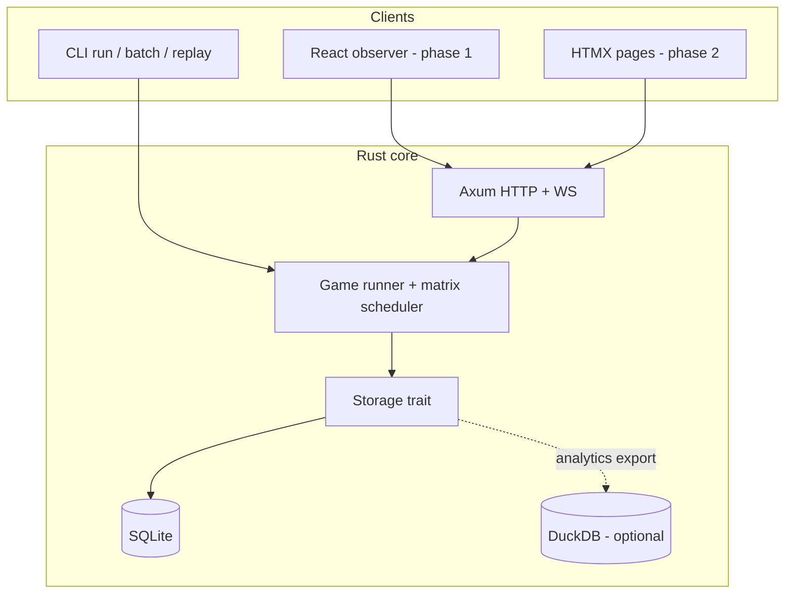

# Plan: AI Arena Roadmap (Server, UI, Persistence, Scale)

## Overview

This plan aligns `TODOS.md` with the current codebase and sequences work from **server mode polish** through **observability**, **persistence/replay**, **matrix + parallelism**, and **new games**. It incorporates accepted product decisions:

| Decision | Choice |
|----------|--------|
| UI direction | **Hybrid**: keep React/Vite for now; design server routes and APIs so an HTMX server-rendered UI can be added later without rewriting the engine |
| First milestone | **Server mode foundation** (host/port, static serving, API tests) |
| Persistence | **Research-backed recommendation below** (SQLite primary; DuckDB optional analytics layer) |

**Source of truth for backlog:** `TODOS.md`  
**Related existing plans:** `plans/secret-configuration-separation.md`, `plans/ollama-agent-support.md`

---

## Current State (May 2026)

### Implemented

- **CLI** (`src/main.rs`): `run`, `batch`, `serve`, `secrets` subcommands
- **Games**: TicTacToe, RockPaperScissors, ConnectFour, Chess (`src/games/`)
- **Agents**: OpenAI, Anthropic, Gemini, Ollama; shared move contract (`MoveRequest` / `MoveResponse`)
- **Stats**: Per-turn `GameStats` with CLI table output (`src/games/display.rs`)
- **Batch**: Sequential CSV runner (`src/csv_runner.rs`)
- **Server**: Axum REST + WebSocket, in-memory sessions on fixed `127.0.0.1:3000` (`src/server/mod.rs`)
- **Web**: React 19 + Vite + Tailwind observer (`web/src/`) — separate dev server, not served by Rust
- **Secrets**: TOML profiles + optional encryption (`src/secrets.rs`)
- **Tests**: 77 Rust unit tests passing (`cargo test`); frontend `npm run build` succeeds

### Gaps vs `TODOS.md`

| TODO item | Status |
|-----------|--------|
| Server binds to chosen host/port | Partial — hardcoded `127.0.0.1:3000` |
| Web UI at root (HTMX) | Not started — React prototype exists instead |
| Connect Four | Done in engine; listed again in TODO is redundant |
| Checkers, Battleship | Not started |
| Game matrix (hundreds of sims) | Not started |
| Parallel game execution | Not started |
| Observe any game (CLI + web, many parallel) | Partial — WS for single game only |
| Replay | Not started |
| Persist games (DB) | Not started |
| Optional: per-AI prompts, leaderboard on disk | Partial — `prompt.rs` exists; no leaderboard |

### Doc / stack drift

- `README.md`: subcommand CLI examples outdated; Chess/Gemini/serve/secrets underdocumented
- `TODOS.md` specifies HTMX; repo has React — **hybrid plan** bridges this
- CSV parser omits Gemini; web POST omits `secret_profile`, `api_endpoint`, `seed`
- `tower-http` `fs` in `Cargo.toml` unused; no integrated production UI bundle

---

## Architecture Target



**Principles**

1. **One game event contract** — replace ad hoc `serde_json::Value` observer payloads with a typed `GameEvent` (turn, state snapshot, error, complete) used by CLI, WS, HTMX partials, and persistence.
2. **Server owns sessions** — in-memory active runs; durable history in SQLite.
3. **UI-agnostic API** — REST + WS (+ later SSE or HTMX-friendly HTML fragments) so React and HTMX can coexist.

---

## Database Recommendation

### Recommendation: **SQLite as system of record**

| Criterion | SQLite | DuckDB | Postgres |
|-----------|--------|--------|----------|
| Local/single-user CLI + server | Excellent | Good | Overkill |
| Turn-by-turn append + replay | Excellent (JSON columns + indexed runs) | Good | Excellent |
| Zero extra services | Yes | Yes (embedded) | No |
| Hundreds–thousands of matrix runs on one machine | Good with WAL + batch inserts | Excellent for analytics queries | Good if hosted |
| Multi-tenant remote deployment | Weak | Weak | Strong |

**Why not DuckDB first?** DuckDB shines at analytical scans (win rates by model, move latency percentiles). AI Arena’s first persistence needs are **transactional writes per turn**, **replay by game id**, and **simple listing** — SQLite is the standard fit and keeps ops trivial.

**Why not Postgres first?** No multi-user hosting requirement yet. Adding Postgres later behind the same `Storage` trait is straightforward if deployment grows.

### Optional phase: DuckDB analytics

- Periodic or on-demand **export/sync** from SQLite → DuckDB (or attach DuckDB and `INSERT SELECT` aggregates).
- Use DuckDB for matrix dashboards: ELO-style summaries, invalid-move rates, provider latency — not for live game loops.

### Schema sketch (SQLite)

```sql
-- runs: one logical match (may be one row in a matrix job)
CREATE TABLE runs (
  id TEXT PRIMARY KEY,
  matrix_job_id TEXT,
  game_type TEXT NOT NULL,
  status TEXT NOT NULL,
  created_at TEXT NOT NULL,
  finished_at TEXT,
  winner TEXT,
  config_json TEXT NOT NULL
);

CREATE TABLE run_agents (
  run_id TEXT NOT NULL,
  slot INTEGER NOT NULL,
  kind TEXT NOT NULL,
  model TEXT NOT NULL,
  temp REAL,
  seed INTEGER,
  secret_profile TEXT,
  PRIMARY KEY (run_id, slot)
);

CREATE TABLE run_events (
  id INTEGER PRIMARY KEY AUTOINCREMENT,
  run_id TEXT NOT NULL,
  seq INTEGER NOT NULL,
  event_type TEXT NOT NULL,
  payload_json TEXT NOT NULL,
  created_at TEXT NOT NULL,
  UNIQUE (run_id, seq)
);

CREATE INDEX idx_run_events_run ON run_events(run_id);
CREATE INDEX idx_runs_matrix ON runs(matrix_job_id);
```

**Crates:** `sqlx` (async, migrations) or `rusqlite` + `tokio::task::spawn_blocking` for simpler integration.

---

## Phased Roadmap

### Phase 0 — Hygiene (parallel, low risk)

**Goal:** Reduce confusion before feature work.

- [ ] Update `README.md` to document subcommands, all games, Gemini, `serve`, secrets
- [ ] Reconcile `TODOS.md` (mark Connect Four done; note hybrid UI)
- [ ] Add Gemini to `csv_runner` agent kind parsing
- [ ] Fix web `POST /api/games` body to send `secret_profile`, `api_endpoint`, `seed`, `temp`
- [ ] Wire or remove orphan `src/secrets_test.rs`
- [ ] Address high-signal warnings (`secrets_manager.set` Result in `main.rs`)

**Exit:** Docs match code; CSV and web configs consistent with `AIAgentConfig`.

---

### Phase 1 — Server mode foundation (Milestone 1 — priority)

**Goal:** Production-shaped `serve` suitable for tests and future HTMX/React static hosting.

**CLI**

```bash
ai_arena serve --host 0.0.0.0 --port 3000 --static-dir web/dist
```

**Tasks**

- [ ] Add `--host`, `--port` (defaults: `127.0.0.1`, `3000`) to `Serve` subcommand
- [ ] Bind `TcpListener` to configured address; log effective URL
- [ ] Serve `GET /` from `--static-dir` when set (`tower_http::services::ServeDir` + `index.html` fallback for SPA)
- [ ] `GET /api/games` — list in-memory sessions (id, game type, status) for UI matrix later
- [ ] Standardize error responses (JSON `{ "error": "..." }` already partial)
- [ ] **Tests:** integration tests using `axum::test` or `reqwest` against spawned server:
  - health returns 200
  - server listens on chosen port (ephemeral port in test)
  - create game returns `game_id`; invalid game type returns 400
  - static route serves `index.html` when dir provided

**Exit:** `cargo test` includes server tests; `ai_arena serve` configurable; optional static bundle at `/`.

---

### Phase 2 — Typed events + single-game observation

**Goal:** Reliable live view for one game in CLI and web (TODOS: observe any game).

**Tasks**

- [ ] Define `GameEvent` enum in `src/games/events.rs` (or `server/events.rs`)
- [ ] Emit events from each game engine instead of raw state JSON only
- [ ] WS: send typed events; keep backward-compatible fields during transition
- [ ] CLI `run --watch` (optional flag): print board/state each turn to stderr or alt screen
- [ ] React: map `GameEvent` to `GameBoard` / `GameLog` (reduce `any`)
- [ ] Chess: minimal board or consistent FEN + last move in events

**Exit:** One CLI game and one web game show the same turn sequence; no silent stuck loops without timeout (document per-game invalid-move policy).

---

### Phase 3 — SQLite persistence + replay

**Goal:** Store every match; replay from disk (TODOS: replay + store games).

**Tasks**

- [ ] `trait GameStorage { create_run, append_event, finish_run, get_run, list_events }`
- [ ] SQLite implementation + migrations (`migrations/001_init.sql`)
- [ ] Persist on server WS path and optionally CLI `run` / `batch`
- [ ] `GET /api/runs/{id}` and `GET /api/runs/{id}/events`
- [ ] CLI: `ai_arena replay <run_id>` — stdout or TUI stepping
- [ ] Web: replay page (React first; HTMX can use same JSON endpoints)

**Exit:** Completed game recoverable after server restart (at least for runs finished while server was up); replay reproduces turn sequence.

---

### Phase 4 — Matrix runner + parallelism

**Goal:** Run hundreds of simulations with live progress (TODOS: matrix UI, parallel games).

**Tasks**

- [ ] `MatrixJob` model: game type, agent grid or CSV-like rows, repetitions, concurrency limit
- [ ] `POST /api/matrix` — start job; `GET /api/matrix/{id}` — progress (queued/running/done/failed counts)
- [ ] Worker pool (`tokio::spawn` + `Semaphore`) — cap concurrency (configurable, default e.g. 4–8)
- [ ] Each child run gets `run_id`; events persisted under `matrix_job_id`
- [ ] React: matrix builder + results table updating via polling or WS
- [ ] HTMX (phase 4b): server-rendered matrix form + partial updates for progress rows

**Exit:** 100+ game job completes with bounded parallelism; UI shows per-run status; click-through opens live observer or replay.

---

### Phase 5 — HTMX UI (hybrid path)

**Goal:** Satisfy `TODOS.md` without deleting React immediately.

**Tasks**

- [ ] Add `templates/` (or `web-htmx/`) with base layout, game form, run list
- [ ] Routes: `GET /` (HTMX shell), `POST /games/start`, `GET /games/{id}/fragment` (board partial)
- [ ] Use same APIs and `GameEvent` stream (SSE or WS + `hx-ext`)
- [ ] Document: React for rich dev UX; HTMX for single-binary deploy

**Exit:** `ai_arena serve --static-dir` can serve either built React or HTMX-first root; feature parity for start + watch one game.

---

### Phase 6 — New games

**Goal:** Checkers, then Battleship (TODOS order).

**Tasks**

- [ ] **Checkers:** 8×8, forced jumps, king promotion — implement `Game` variant + tests before LLM prompts
- [ ] **Battleship:** hidden board + shot coordinate schema; longer matches — consider stricter turn cap
- [ ] Register in `Game::new`, CSV, server, both UIs
- [ ] Update README game table

**Exit:** Each game has unit tests for rules; one smoke LLM match documented in plan or README.

---

### Phase 7 — Optional backlog

- [ ] Per-agent custom prompts (extend `AIAgentConfig` + secrets-safe prompt files)
- [ ] Leaderboard materialized view (SQLite table or DuckDB aggregate)
- [ ] DuckDB export job + example analytics queries
- [ ] CI: `cargo test`, `cargo clippy`, `npm run build` in GitHub Actions
- [ ] Auth for server (local token) if binding beyond localhost

---

## Risks and Mitigations

| Risk | Mitigation |
|------|------------|
| Missing API keys panic via `.expect()` | Return `Result` from `build_agents`; surface 400/500 in API |
| Invalid moves cause infinite loops | Per-game max invalid retries; global max turns; mark run failed |
| LLM cost / rate limits on matrix | Concurrency cap; optional dry-run/mock agent for tests |
| Two UIs diverge | Single `GameEvent` + OpenAPI or README contract |
| SQLite write contention on huge matrix | Batch inserts; WAL mode; single writer task per process |
| React + HTMX maintenance | Hybrid: shared backend; HTMX only after APIs stable (Phase 5) |

---

## Success Metrics

| Phase | Metric |
|-------|--------|
| 1 | Server integration tests green; bind on arbitrary port verified |
| 2 | CLI and web show identical turn count for same `run_id` |
| 3 | Replay from DB matches original WS stream |
| 4 | Matrix of ≥100 games completes; no OOM at default concurrency |
| 5 | HTMX root page starts and watches one game without React dev server |
| 6 | Checkers unit tests + one recorded agent match |

---

## Implementation Order (summary)

1. **Phase 0** — docs + config parity  
2. **Phase 1** — server host/port/static + tests *(accepted first milestone)*  
3. **Phase 2** — typed `GameEvent` + observation  
4. **Phase 3** — SQLite + replay  
5. **Phase 4** — matrix + parallelism  
6. **Phase 5** — HTMX layer  
7. **Phase 6** — Checkers, Battleship  
8. **Phase 7** — optional analytics and polish  

---

## Out of Scope (this plan)

- Multi-user auth and hosted Postgres (until deployment model is chosen)
- Full chess board renderer (minimal FEN acceptable until Phase 2)
- “Allow cheating” mode from README open questions
- Replacing React in Phase 1–4 (deferred to Phase 5)

---

## Acceptance

This plan is **accepted** when stored at `plans/ai-arena-roadmap.md` and used as the sequencing reference for implementation PRs. First implementation slice: **Phase 1 — Server mode foundation**.
